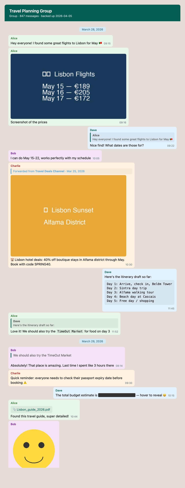

# tg-backuper

CLI tool for backing up Telegram chats. Connects to your Telegram account, lets you pick a chat via an interactive terminal menu, and exports messages to JSON and a styled HTML file.

## Screenshot



See the full [demo HTML](assets/demo.html) for an interactive preview.

## Features

- Interactive chat selection with search
- Full message history export (text, media, replies, forwards)
- JSON export with complete message metadata
- Standalone HTML viewer with WhatsApp-style layout, sender colors, reply previews, and text formatting
- Optional media download with automatic retry and flood-wait handling

## Prerequisites

- Python 3.8+
- Telegram API credentials from [my.telegram.org](https://my.telegram.org)

## Setup

1. Clone the repository:

```bash
git clone https://github.com/RustamG/tg-backuper.git
cd tg-backuper
```

2. Install dependencies:

```bash
pip install -r requirements.txt
```

3. Create a `.env` file with your Telegram API credentials:

```
API_ID=your_api_id
API_HASH=your_api_hash
PHONE=+1234567890
```

See `.env.example` for reference.

## Usage

```bash
python main.py
```

On first run you will be prompted to authenticate with your Telegram account. A session file (`tg_backuper.session`) is saved so you only need to log in once.

After authentication, the tool will:

1. Display a searchable list of your chats
2. Let you choose a backup type (with or without media)
3. Export the chat to a timestamped folder

## Output

Backups are saved to `backups/<timestamp>/`:

```
backups/2025-01-15_12-30-00/
├── messages.json    # Full message data
├── chat.html        # Standalone HTML viewer
└── media/           # Downloaded media files (if selected)
```

- **messages.json** — complete message history with sender info, replies, forwards, and media references
- **chat.html** — self-contained HTML file you can open in any browser, no server needed
